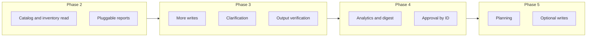

# Magnus Assistant — Roadmap to a Fully Capable AI Agent for Magento Stores

**Goal:** Evolve Magnus from **Semi-Agent** to a **fully capable store operator**—the Magento equivalent of Shopify Sidekick: an AI that merchants can trust for day-to-day operations with light supervision.

**Current state (post–Phase 1):** Multi-turn tool context, two write actions (config_update, catalog_price_rule_create), revenue/AOV/order count report, and decoupled ToolExecutor. See [AGENTIC_MATURITY_AUDIT.md](AGENTIC_MATURITY_AUDIT.md) for the scorecard.

**Target:** **Operator** — read and analyze store data, navigate and open admin pages, propose and execute approved writes, handle multi-step workflows, clarify when needed, recover from errors, and verify outcomes.

---

## 1. Definition of “Fully Capable”

| Capability | Definition | Current | Target |
|------------|------------|---------|--------|
| **Read and analyze** | Answer “why conversions down?”, “slow-moving inventory?”, “top products by margin” with real data | Partial (revenue/AOV, top products) | Full (period-over-period, inventory, margin) |
| **Navigate and open** | Deep links to products, orders, config, promos, categories | Yes | Keep |
| **Propose and execute (with approval)** | Config, catalog rule, cart rule, product bulk, optional product create/update | Config + catalog rule only | Config, both rule types, product bulk, optional product/inventory |
| **Multi-step workflows** | One conversation: report → identify → propose → approve → execute | Yes (tool context) | Keep; add planning visibility |
| **Clarify when needed** | “Need date range / store view / product set” with optional persisted slot | No | Yes (protocol or tool) |
| **Recover from errors** | Retry or suggest alternatives; structured error hints to LLM | Message only | Hints + optional retry |
| **Verify outcomes** | “I updated X” or “search returned 0; try Y” so merchant knows what happened | No | Yes (empty/failure hints; optional post-execution check) |

---

## 2. Roadmap Overview

| Phase | Focus | Outcome |
|-------|--------|--------|
| **Phase 2** | Catalog and inventory read; pluggable reports | “Missing images,” “low stock,” “slow-moving” answered with data and links |
| **Phase 3** | More writes, clarification, verification | Cart rules, product bulk; agent asks for missing info; tool results indicate “no data” / “try X” |
| **Phase 4** | Analytics depth and approval UX | Period-over-period, “what to do today” digest; approve by action ID |
| **Phase 5** | Planning and optional writes | Explicit plan for compound tasks; product create/update, inventory (optional) |

---

## 3. Phase 2 — Catalog and Inventory Read (done)

**Goal:** Answer “products missing images,” “low stock,” “slow-moving inventory” with real data and optional admin links.

| # | Item | Type | Effort | Notes |
|---|------|------|--------|-------|
| 2.1 | **Tool: products missing images** | Tool | Medium | **Done.** Report metric `missing_images` in semantic report layer; handler uses catalog product collection + image attribute. |
| 2.2 | **Tool: low stock / out-of-stock** | Tool | Medium | **Done.** Report metric `low_stock`; handler uses legacy `cataloginventory_stock_item` join. |
| 2.3 | **Tool or report: slow-moving** | Tool/Report | Medium | **Done.** Report metric `slow_moving`; products with no sales in N days via order item data. |
| 2.4 | **ReportTool: pluggable report types** | Technical | Medium | **Done.** Semantic report layer: `ReportSpec` + `ReportHandlerInterface` + `ReportHandlerPool`; `run_report` accepts `report_spec` (metric, dimensions, filters, limit). |
| 2.5 | **Product copy (Writer)** | Action + Tool | Medium | **Done.** `get_product_for_copy` tool; `product_copy_apply` action (suggest → approve → apply name, descriptions, meta). |

**Success criteria:** User can ask “which products have no image?” or “show me low stock” and get a list/count. “Slow-moving” returns data for a configurable period. Product copy: get_product_for_copy → propose product_copy_apply → approve → apply.

---

## 4. Phase 3 — More Writes, Clarification, Verification

**Goal:** Broader write coverage, structured “I need X” clarification, and tool/action result hints so the agent does not present empty or wrong data as success.

| # | Item | Type | Effort | Notes |
|---|------|------|--------|-------|
| 3.1 | **Action: cart_price_rule_create** | Action | High | Create cart price rule (and optional coupon code). Params: name, conditions, discount, dates, coupon. Use `Magento\SalesRule` API or model. Register in ActionTypeRegistry. |
| 3.2 | **Action: product_bulk_update** | Action | Medium | Bulk update product status and/or visibility for a set of IDs (or category). Approval required. Validate IDs/category; call product repository or bulk API. |
| 3.3 | **Structured clarification** | Technical | Medium | Option A: System prompt protocol — “If the request is ambiguous (e.g. date range, store view), ask once before running reports or actions.” Option B: Tool `ask_clarification` that returns a structured “need: date_range” so UI can show a prompt. Option C: Persist “pending clarification” (e.g. conversation metadata) so next user message is interpreted in context. Prefer A for simplicity; add B/C if UX requires. |
| 3.4 | **Output verification** | Technical | Low | For key tools (search_products, run_report, etc.): if result is empty or indicates failure, append a short line to the tool result (e.g. “No data for this period” or “Search returned 0; try different keywords”). Optional: one automatic retry with modified params when a report returns empty. |

**Success criteria:** “Create a cart rule for free shipping over $50” → propose → approve → execute. “What was revenue last 7 days?” with no date in message → agent asks for date range (or uses default). Empty report returns explicit “No orders in that period” in the tool result.

**Files to touch:** New action classes, `ActionTypeRegistry` in di.xml, `PromptBuilder` (clarification guidance), tool classes or `ToolExecutor`/response formatter for verification hints.

---

## 5. Phase 4 — Analytics Depth and Approval UX

**Goal:** “Why are conversions down?” and “what should I do today?” answered with data; user can approve a specific pending action by ID, not only “latest.”

| # | Item | Type | Effort | Notes |
|---|------|------|--------|-------|
| 4.1 | **Report: period-over-period** | Tool/Report | Medium | Compare orders/revenue (and optionally AOV) for two periods (e.g. last 7 days vs previous 7). Expose as report type (e.g. `period_over_period`) with `days` and optional `compare_previous`. |
| 4.2 | **Tool: config audit (shipping/payment)** | Tool | Low | Summarize shipping and payment config (carriers, methods, enabled) for “audit” questions. Read-only; can use config paths or dedicated collectors. |
| 4.3 | **Composite / digest: “what to do today”** | Tool/Composite | Medium | Tool or composite that combines: low stock count, recent orders summary, active promos count (or similar). Returns a short, data-backed list so the agent can answer “what should I do today?” with real store state. |
| 4.4 | **Approval by action ID** | Technical | Low | Today only “latest” can be approved. Extend ApprovalDetector and/or UI so the user can approve a specific pending action by ID (e.g. “approve 42” or a button per proposal). Requires listing pending actions and passing action_id to execute. |

**Success criteria:** “Why are my conversions down?” returns a period comparison. “What should I do today?” returns a short digest (e.g. “3 low-stock items, 5 orders yesterday, 2 active promos”). User can approve action by ID when multiple proposals exist.

**Files to touch:** ReportTool or report registry, new tool(s), `ApprovalDetector`, frontend (if approval is UI-driven).

---

## 6. Phase 5 — Planning and Optional Writes

**Goal:** Compound tasks (“prepare for Black Friday”) get an explicit plan or checklist; optional product and inventory writes for stores that need them.

| # | Item | Type | Effort | Notes |
|---|------|------|--------|-------|
| 5.1 | **Explicit planning or checklist** | Technical/Tool | Medium | Option A: Tool that returns a checklist for a given intent (e.g. “Black Friday” → catalog, promos, inventory, config) with status (e.g. “2 catalog rules active”). Option B: System prompt + tool pattern that encourages the model to output “Plan: 1. … 2. …” and then execute step by step. Reduces “stop too early” and improves completeness. |
| 5.2 | **Action: product_create / product_update** | Action | High | Optional. Create or update product with minimal attributes (name, SKU, price, status, visibility). High effort due to validation and attribute sets. |
| 5.3 | **Action: inventory_update** | Action | Medium | Optional. Update stock for one or more SKUs. Depends on Magento Inventory (MSI) or legacy stock. |

**Success criteria:** “Prepare my store for Black Friday” yields a visible plan or checklist and the agent can work through it. Optional: product and inventory changes executable via propose_action after approval.

**Files to touch:** New tool or prompt design, new action classes (optional), ActionTypeRegistry.

---

## 7. Cross-Cutting and Maintenance

- **Error classification (optional):** Classify errors (rate limit, validation, backend) and return structured hints to the LLM or user. Low priority if generic message is acceptable.
- **Documentation:** Keep [AGENTIC_MATURITY_AUDIT.md](AGENTIC_MATURITY_AUDIT.md) and this roadmap updated as phases ship.
- **Testing:** Add or extend integration tests for new tools and actions (e.g. report types, config_update, catalog_price_rule_create, and new actions).
- **Security and performance:** New tools and actions should follow existing patterns (approval for writes, read-only by default, rate limiting, audit log). For report tools, consider query limits and timeouts.

---

## 8. Suggested Implementation Order

1. **Phase 2** — Delivers immediate merchant value (catalog/inventory visibility) and the pluggable report design unblocks Phase 4 report types without churn in ReportTool.
2. **Phase 3** — Clarification and output verification improve reliability; cart rule and product bulk expand write coverage.
3. **Phase 4** — Analytics and digest close the “why conversions down?” and “what to do today?” gaps; approval by ID improves UX when multiple proposals exist.
4. **Phase 5** — Planning improves compound-task completeness; product/inventory actions are optional and can be deferred or scoped per deployment.

---

## 9. Summary: From Semi-Agent to Operator

| Lever | Now (Semi-Agent) | After roadmap (Operator) |
|-------|-------------------|---------------------------|
| **Reports** | Top products, revenue/AOV/orders | + Period-over-period, slow-moving, missing images, low stock, config audit, daily digest |
| **Writes** | config_update, catalog_price_rule_create | + cart_price_rule_create, product_bulk_update; optional product_create/update, inventory_update |
| **Clarification** | Natural language only | Structured “need X” and/or prompt protocol |
| **Verification** | None | Empty/failure hints in tool results; optional post-execution check |
| **Approval** | Latest only | By action ID when multiple pending |
| **Planning** | Emergent from model | Explicit plan or checklist for compound tasks |

When these are in place, Magnus will be a **fully capable AI agent for Magento stores** at Operator level: merchants can run day-to-day operations with light supervision, with data-backed answers, executable actions (with approval), and clearer outcomes and recovery behavior.

---

## 10. Alignment with Product Plans

This roadmap is intended to align with (and extend) the broader Sidekick vision in:

- **`docs/plans/2026-02-11-magento-sidekick-features-and-learning.md`** — Full feature list, instance learning, Tier 1–4 ranking, and deliverable phases (Phase 1 Foundation → Phase 6 Tier 4).
- **`docs/plans/2026-02-13-magento-sidekick-product-engineering-plan.md`** — Product engineering plan, action framework, and sprint order (Phase 1 → Phase 2 Q&A → Phase 3 Tier 1).

**Where we are:** The **action execution framework** from the engineering plan is in place (ActionInterface, ActionProposal, ActionRegistry, ApprovalDetector, ActionExecutor, propose_action → approve → execute). Magnus already has two write actions (config_update, catalog_price_rule_create), multi-turn tool context, revenue/AOV report, and instance-aware Q&A (how_do_i, config explanation, reports). So we are **past** the engineering plan’s “Sprint 1–2: Action Framework” and largely past “Phase 2 MVP Q&A” in the features doc (we have config explanation, how do I, and more than one report).

**How this roadmap fits:**

| This roadmap | Maps to product plans |
|--------------|------------------------|
| **Phase 2** (catalog/inventory read, pluggable reports) | Extends “NL reports” and “suggested questions” (e.g. at-risk stock, slow-moving); supports Tier 1 “reports” and Tier 2 “suggested questions (full)”. |
| **Phase 3** (cart rule, product bulk, clarification, verification) | Completes “Discounts / promotions” (5.3) with **cart** rules; adds product bulk; aligns with “no execution without approval” and reliability (clarification, verification). |
| **Phase 4** (period-over-period, digest, approval by ID) | Delivers “Benchmarks / goals” (5.5) and “How am I doing vs last month?”; “what to do today” digest is a step toward **Pulse** (7.1–7.4). Approval by ID improves UX when multiple proposals exist. |
| **Phase 5** (planning, optional product/inventory writes) | Aligns with “Setup wizard / checklist” (4.3) style planning and optional scale (product create/update, inventory). |

**Gaps to consider (from the product plans):**

1. **Product copy (Writer)** — Ranked #2 in the features doc (Tier 1). “Generate product name/description/meta from attributes → suggest → approve → apply.” Not in this roadmap; add as a dedicated track if Sidekick-parity for content generation is a goal.
2. **Pulse (proactive cards)** — Tier 1 in both plans. This roadmap has “what to do today” digest (data-backed list); full Pulse adds cron-driven cards, persistence, “Act on this,” and citations. Consider adding a **Pulse** item (e.g. in Phase 4 or a dedicated phase) if proactive recommendations are in scope.
3. **Export (reports)** — Phase 3 in the features doc and engineering plan. “Download CSV” (or equivalent) for report answers. Not in this roadmap; add under Phase 3 or 4 for report completeness.
4. **Config recommendations** — Features doc 4.2: suggest config changes with reasoning; apply only after approval. We have **config_update** (execute) but not a dedicated “suggest improvements” flow. Could be a small addition (prompt + optional tool) or folded into clarification/verification.

**Verdict:** The roadmap **makes sense** and moves Magnus in the right direction: more data (catalog/inventory, period-over-period, digest), more writes (cart rule, product bulk), and better behavior (clarification, verification, approval by ID, planning). To fully align with the product plans, consider explicitly adding **product copy**, **Pulse** (or a path to it), **export for reports**, and optionally **config recommendations**. Phase numbering here is “next steps after Operator Phase 1,” not a 1:1 match with the features doc Phase 1–6 labels.

---

*This roadmap is derived from the Operator audit (Phase 1 plan), the Agentic Maturity Audit, and the goal of Sidekick-equivalent capability for Magento. It is aligned with `docs/plans/2026-02-11-magento-sidekick-features-and-learning.md` and `docs/plans/2026-02-13-magento-sidekick-product-engineering-plan.md`; priorities and scope can be adjusted per product and resource constraints.*
